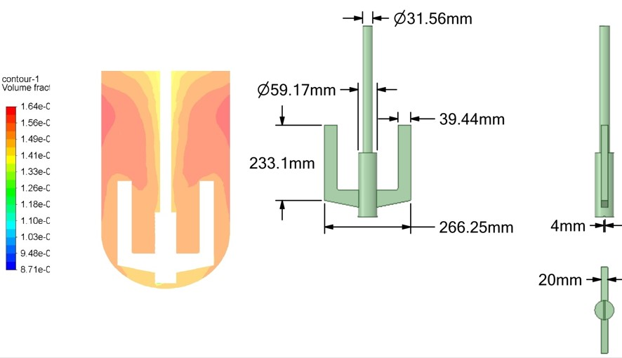

# CFD-Visions
“Showcasing the simulation modeling work of Dr. Rawad Deeb, demonstrating my approach to CFD, heat and mass transfer, and fluid dynamics. This portfolio highlights my projects, experiments, 2D/3D simulations, and methodology, proving I’m ready to tackle professional modeling assignments.”
<!DOCTYPE html>
<html lang="ru">
<head>
    <meta charset="UTF-8">
    <meta name="viewport" content="width=device-width, initial-scale=1.0">
    <title>Rawad Deeb — CFD Portfolio</title>
    
</head>
<body>

<header>
    <h1>Rawad Deeb</h1>
    
CFD моделирования | Инженер по тепло- и гидродинамике

    <nav>
        <a href="#works">Мои работы</a>
        <a href="#articles">Статьи</a>
        <a href="#media">Фото/Видео</a>
    </nav>
</header>

<section id="works">
    <h2>Мои работы</h2>
    <ul>
        <li>Тепломассообмен</li>
        <li>Гидродинамика</li>
        <li>Ламинарные и турбулентные течения</li>
        <li>Серфинг (Surfing)</li>
        <li>Разработка теплообменников</li>
        <li>Испытание на прочность</li>
        <li>Воздушные винты (самолеты)</li>
        <li>2D и 3D моделирование</li>
        <li>Горение</li>
        <li>Стационарные и нестационарные задачи</li>
        <li>Однофазные и двухфазные системы</li>
        <li>Эжекторы и инжекторы</li>
    </ul>
</section>

<section id="articles">
    <h2>Мои статьи</h2>
    <ul>
        <li>Deeb R., Sidenkov D.V. Numerical and Experimental Investigation of Heat Transfer in Cable Heated Pipeline, 2018.</li>
        <li>Deeb R., Sidenkov D.V. Numerical simulation of the heat transfer of staggered drop-shaped tubes bundle, 2018-2020.</li>
        <li>Deeb R., Effect of Longitudinal Spacing on The Flow and Heat Transfer for Staggered Drop-shaped Tubes Bundle in Cross-flow, 2020.</li>
        <li>Deeb R., Numerical analysis of heat transfer and fluid flow around circular and non-circular tubes, 2021.</li>
        <li>Deeb R., Enhancing heat exchanger performance through hybrid angle of attack control for drop-shaped tubes, 2023.</li>
        <!-- Добавьте больше статей по желанию -->
    </ul>
</section>

<section id="media">
    <h2>Фото и видео</h2>
    

        
        
        
        
        
        
        <video controls src="videos/burner.mp4">Ваш браузер не поддерживает видео</video>
        <video controls src="videos/ejector.mp4">Ваш браузер не поддерживает видео</video>
    

</section>

</body>
</html>
